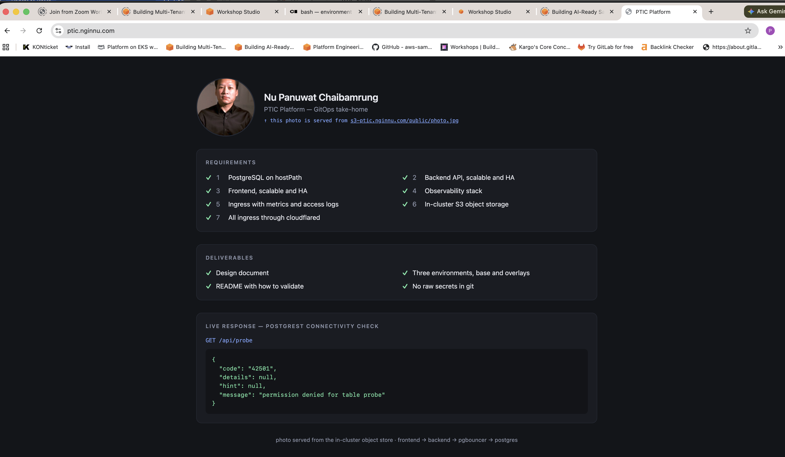
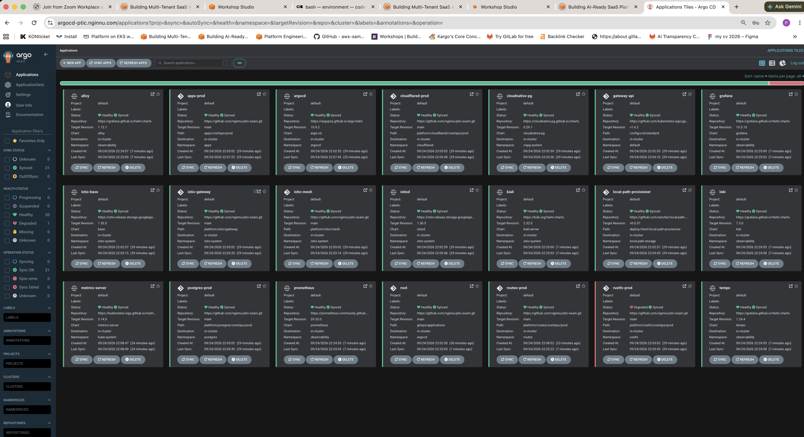
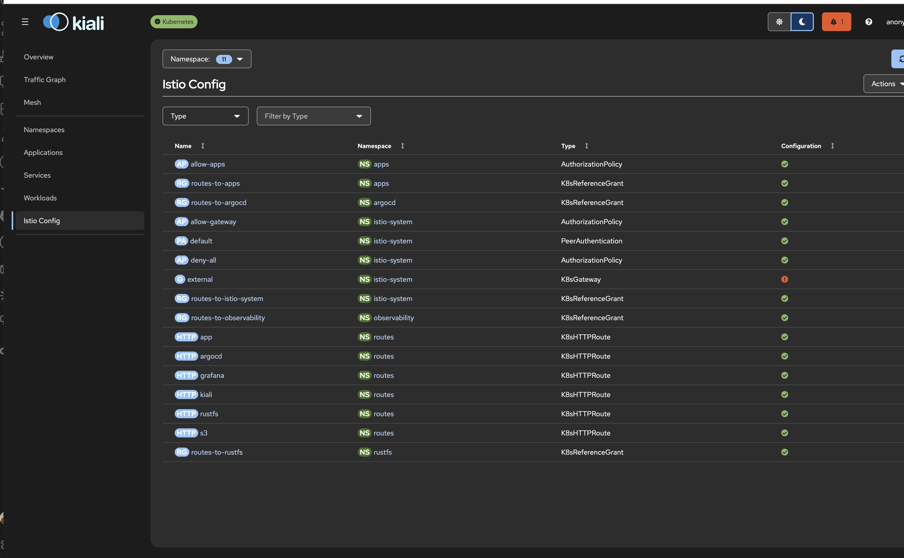
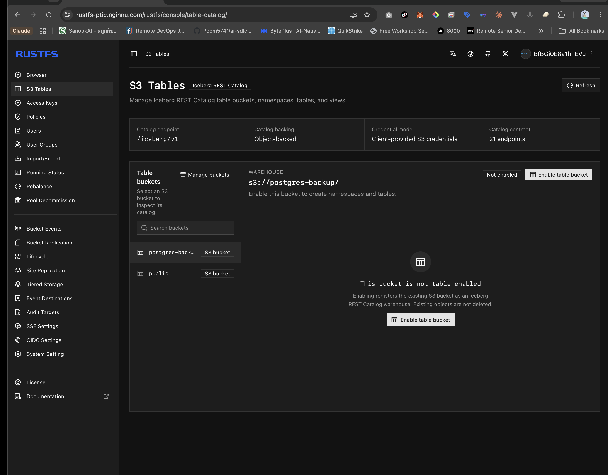
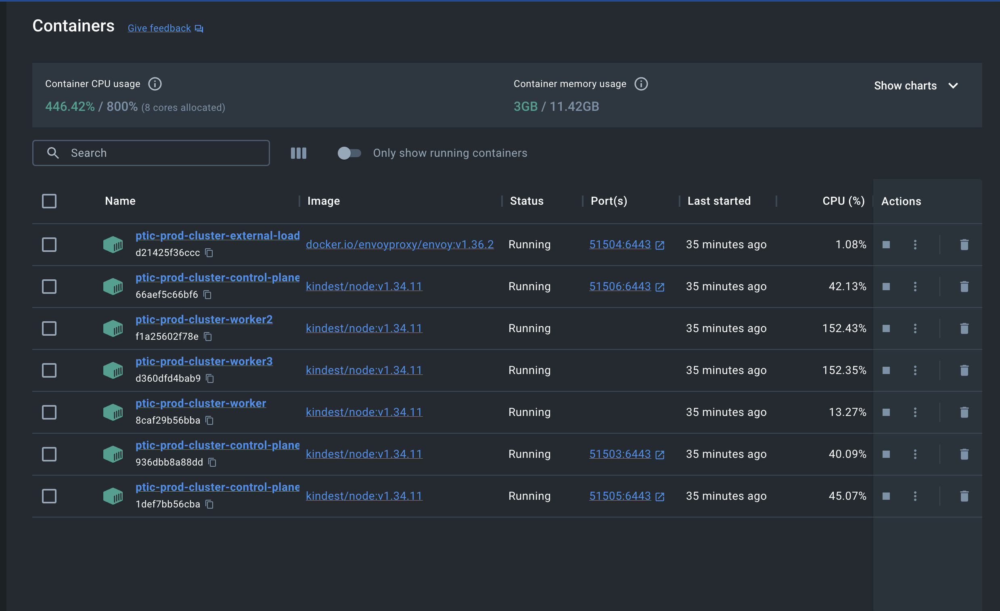

# ptic-exam

GitOps repository for a bare-metal Kubernetes homelab running three environments: `dev`, `staging` and `prod`.

## Scope

| Component | Choice |
| --- | --- |
| Delivery | Argo CD, managing itself from this repository |
| Database | CloudNativePG on hostPath |
| Connection pooling | pgbouncer through a CNPG Pooler |
| Backend API | PostgREST, scalable and HA |
| Frontend | Static page reading the API, scalable and HA |
| Ingress | Istio implementing the Kubernetes Gateway API |
| Object storage | RustFS, in-cluster and S3-compatible |
| Autoscaling | HPA on CPU, fed by metrics-server |
| Observability | Alloy, Prometheus, Loki, Tempo, Grafana, Kiali |
| External access | cloudflared tunnel, the only inbound path |

## Repository layout

| Path | Contents |
| --- | --- |
| `cluster/` | Cluster topology, one file per environment |
| `bootstrap/` | Argo CD installation, applied once by hand |
| `gitops/` | Root application and the Applications it watches |
| `platform/` | Platform components and their values |
| `apps/base/` | Application manifests shared by every environment |
| `apps/overlays/` | Per-environment overlays for `dev`, `staging` and `prod` |
| `docs/` | Design document and build notes |

## Render the manifests

```
make build
```

Renders every environment without a cluster. It needs `kustomize`, `ksops` and an age key that can decrypt the files in this repository, so follow the secrets step in [docs/install.md](docs/install.md) first.

## Install

| Command | What it does |
| --- | --- |
| `make check-tools` | Report tools missing from this machine |
| `make install-cluster` | Create the cluster for `ENV` |
| `make install-argocd` | Install Argo CD and apply the root application |
| `make validate` | Check that what is installed actually works |
| `make delete-cluster` | Remove the cluster |

`ENV` selects the environment: `dev`, `staging` or `prod`. Step by step: [docs/install.md](docs/install.md).

## Validate with a cluster

`make validate` checks results rather than the presence of objects. Each topic also runs on its own as `make validate-<topic>`.

| Topic | What it proves |
| --- | --- |
| `manifests` | Every overlay renders, secrets included |
| `cluster` | Node counts, etcd members and taints match the environment's config |
| `gitops` | Argo CD healthy, every Application synced, no Service exposed outside the cluster |
| `storage` | An object written to the store and read back unchanged |
| `database` | The database accepts a write; the replica follows the primary |
| `backup` | A forced WAL switch lands a segment in the object store; a new backup completes |
| `apps` | The API answers, reaches the database through the pooler, and each HPA reads a CPU figure |
| `routes` | The page renders through the gateway |
| `ingress` | Strict mTLS, access logging on, the proxy exporting metrics and writing logs |
| `observability` | A metric, a log line and a trace emitted and read back out |

## Bootstrap assumptions

- The cluster exists and is reachable.
- An age key pair for SOPS exists outside this repository, and the encrypted files here have been re-encrypted with it.
- A Cloudflare tunnel has been created and its credentials encrypted into this repository.

## Running system

Every address below is served through the Cloudflare tunnel. The cluster has no public IP and no load balancer.

| URL | What it is |
| --- | --- |
| https://ptic.nginnu.com/ | The frontend, reading the API |
| https://argocd-ptic.nginnu.com/ | Argo CD, showing every Application and its sync state |
| https://grafana-ptic.nginnu.com/ | Grafana, reading Prometheus, Loki and Tempo |
| https://kiali-ptic.nginnu.com/ | Kiali, showing the mesh and its traffic |
| https://rustfs-ptic.nginnu.com/rustfs/console/ | The object store console |
| https://s3-ptic.nginnu.com/public/photo.jpg | An object served from the store |

### The frontend, through the tunnel



### Argo CD, every Application synced from this repository



### Kiali, showing the mesh policy in effect



### The object store, holding the backup bucket



### The cluster: three control planes and three workers



## Documents

| Document | What is in it |
| --- | --- |
| [docs/design.md](docs/design.md) | Goals, topology, repository layout, promotion, secrets, hostPath risks, the tunnel model and the observability paths |
| [docs/install.md](docs/install.md) | From an empty machine to a validated cluster, step by step |
| [docs/PROGRESS.md](docs/PROGRESS.md) | What exists in this repository and why, phase by phase |

---

The focus here is the GitOps structure and the tunnel that makes it work on bare metal. Other areas go only as deep as that needed — happy to go into any of them.
